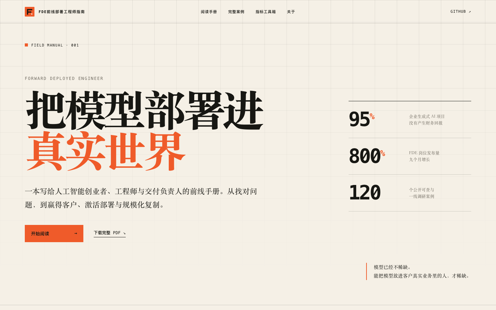
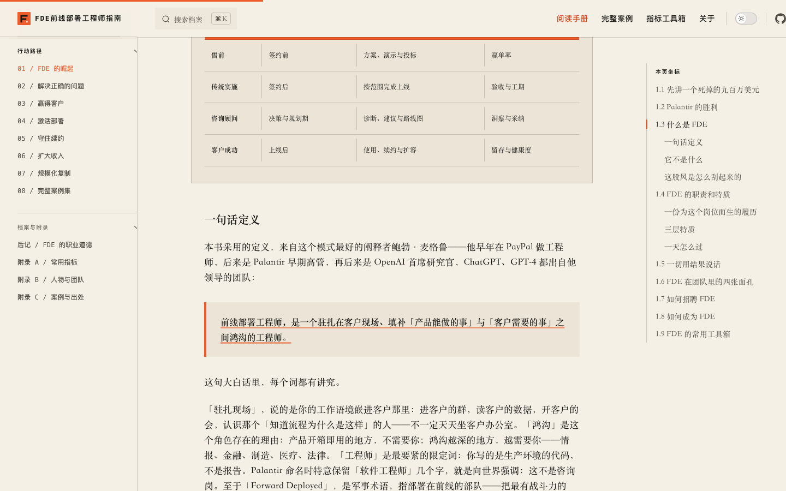
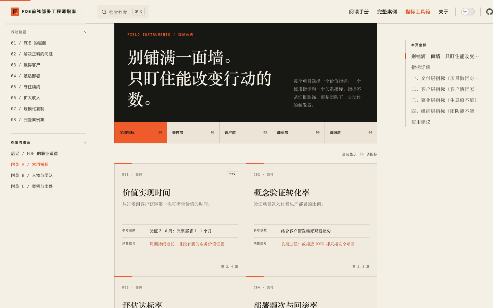

# FDE前线部署工程师指南

> 基于《前线部署工程师：人工智能时代的客户价值交付秘籍》公开书稿改造的 VitePress 技术学习站点。

这个项目保留了原书完整的章节、案例、附录与 PDF，并在此基础上重新设计了在线阅读体验：更清晰的知识路径、更舒适的长文排版、更快速的全文检索，以及面向实践的方法论图表和指标工具箱。

**[在线阅读](https://fde-handbook-iegicbsj.edgeone.cool/)** · **[下载完整 PDF](前线部署工程师（FDE）v1.0.6.pdf)** · **[从第一章开始](01-第1章-FDE的崛起.md)**



## 为什么改造成技术学习站点

原项目是一套结构完整、资料扎实的 Markdown 公开书稿，非常适合在 GitHub 中阅读和传播。但面对十余万字的长篇内容，纯文件目录仍然存在一些限制：章节之间不容易建立整体认知，长文定位和回看成本较高，案例、角色与指标之间的关联也不够直观。

这次站点化改造并不改变原书观点，而是尝试为内容增加一层更适合持续学习的界面：

- 用完整章节导航和本页目录降低长文定位成本
- 用全文搜索快速找到人物、公司、指标与方法
- 用章节导读提前说明阅读时间、当前阶段和关键结论
- 用角色矩阵、部署路径和价值飞轮呈现核心方法论
- 用可筛选的指标工具箱连接定义、参考读数、预警信号与对应章节
- 用响应式排版、深色模式和阅读进度改善桌面端与移动端体验

它既是一本可以从头读完的在线书，也是一个需要时可以回来查阅的 FDE 学习手册。

## 阅读体验

### 专注、连贯的长文阅读

每章提供左侧行动路径、右侧本页坐标、阅读进度和上下章跳转。章节开头增加阅读导引，帮助读者先建立问题意识，再进入正文。



### 可操作的指标工具箱

附录 A 已从连续文本扩展为一套可筛选的现场仪表，收录 20 项核心指标，覆盖交付、客户、商业和组织四个层面。每项指标同时呈现定义、参考读数、预警信号和关联章节，原始详解仍完整保留。



## 内容概览

全书沿着一次真实企业 AI 交付的完整旅程展开：

| 阶段 | 章节 | 核心问题 |
| --- | --- | --- |
| 识别角色 | [第 1 章：FDE 的崛起](01-第1章-FDE的崛起.md) | FDE 为什么出现，它与售前、实施和咨询有什么不同 |
| 选择战场 | [第 2 章：解决正确的问题](02-第2章-解决正确的问题.md) | 如何避开概念验证坟墓，找到问题与方案的契合 |
| 进入现场 | [第 3 章：赢得客户](03-第3章-赢得客户.md) | 如何筛选灯塔客户并建立企业级信任 |
| 制造价值 | [第 4 章：激活部署](04-第4章-激活部署.md) | 如何让上线真正变成稳定使用 |
| 守住阵地 | [第 5 章：守住续约](05-第5章-守住续约.md) | 如何通过健康度和组织关系持续创造价值 |
| 扩大战果 | [第 6 章：扩大收入](06-第6章-扩大收入.md) | 如何把业务结果转化为定价与扩张能力 |
| 沉淀能力 | [第 7 章：规模化复制](07-第7章-规模化复制.md) | 如何让现场经验回流产品并形成复利 |
| 复盘现场 | [第 8 章：完整案例集](08-第8章-完整案例集.md) | 不同公司和市场如何实践 FDE 模式 |

此外还包括：

- [后记：FDE 的职业道德](09-后记-FDE的职业道德.md)
- [附录 A：FDE 应当关注的常用指标](10-附录A-FDE应当关注的常用指标.md)
- [附录 B：FDE 人物与团队名单](11-附录B-FDE人物与团队名单.md)
- [附录 C：全书案例索引与资料出处](12-附录C-全书案例索引与资料出处.md)

全书整理了 120 个案例条目，涉及 Palantir、OpenAI、Anthropic、Harvey、Sierra，以及中国本土的早期实践者。

## 本地运行

项目基于 [VitePress](https://vitepress.dev/) 和 Vue 3 构建。

```bash
# 安装依赖
npm install

# 启动本地开发环境
npm run docs:dev

# 生成生产版本
npm run docs:build

# 本地预览生产版本
npm run docs:preview
```

核心目录：

```text
.
├── .vitepress/          # 站点配置、自定义主题和交互组件
├── diagrams/            # 可继续编辑的 draw.io 方法论图表
├── docs/images/         # README 页面截图
├── public/              # 站点静态资源
├── 01-...08-...md       # 正文章节
├── 09-...12-...md       # 后记与附录
└── index.md             # 站点首页入口
```

## 关于原书

本项目的内容基础是范冰（XDash）撰写的《前线部署工程师：人工智能时代的客户价值交付秘籍》。原书试图回答三个问题：

- **FDE 是什么**：这个从 Palantir 情报项目中成长出来的角色，为何在人工智能时代迅速爆发
- **FDE 怎么做**：如何找对问题、赢得客户、激活部署、守住续约、扩大收入并规模化复制
- **谁在实践**：全球与中国市场中有哪些可以查证和复盘的真实案例

书中数据、观点和案例的资料出处见[附录 C](12-附录C-全书案例索引与资料出处.md)。如果发现疏漏，欢迎提交 Issue 或修订建议。

## 关于作者

范冰，网名 XDash，互联网从业者，《增长黑客》作者，zengzhang.ai 主理人，长期关注技术趋势与商业方法论。本书为个人研究整理，不代表任何机构立场。

- 微信：ifanbing（注明「FDE」）
- 邮箱：xdash@duck.com

## 参与完善

欢迎通过 Issue 或 Pull Request：

- 修正错别字、失效链接和资料出处
- 补充新的 FDE 案例与一线经验
- 改善移动端、无障碍和阅读体验
- 继续完善图表、指标与案例结构化能力

## 版权声明

本书著作权归作者范冰所有。本仓库内容由作者本人授权公开，供读者**免费阅读与非商业性分享**。转载请注明出处与作者；任何商业用途，包括但不限于出版、培训和付费内容改编，须事先获得作者书面许可。

如果这份内容对你有帮助，欢迎 Star 本项目，或把它分享给正在探索企业 AI 落地与 FDE 职业路径的人。
